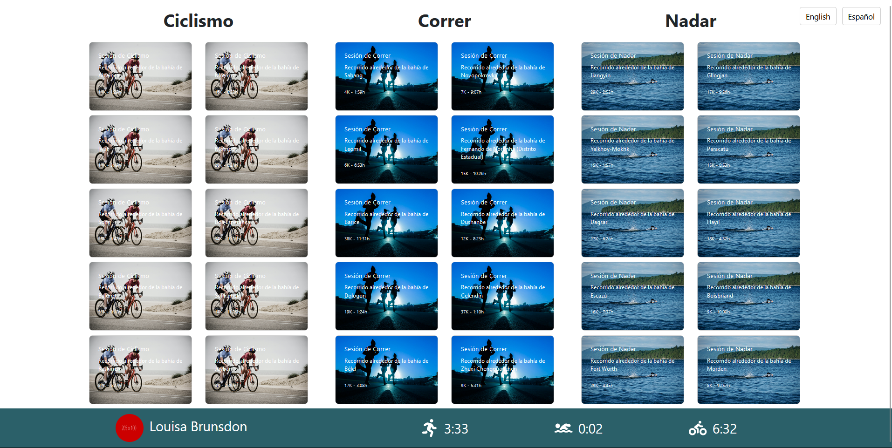

# Parcial 1 Web

Esta aplicación es un MVP para un rastreador de tiempos deportivos enfocado en triatlón. Se ha desarrollado utilizando React con pantllas básicas como autenticación (login), visualización de sesiones deportivas (Running, Swimming, Cycling) y un detalle modal para cada sesión. La aplicación también incluye soporte para internacionalización (i18n) en inglés y español.

## Instalación

### Requisitos

- **Node.js** y **npm** instalados.

### Pasos para ejecutar la aplicación

1. Clona el repositorio.
   
   ```bash
   git clone https://github.com/eduardoh27/Parcial1-Web
   ```

2. Navega al directorio del proyecto.

   ```bash
   cd myapp
   ```

3. Instala las dependencias del proyecto:

   ```bash
   npm install
   ```

4. Inicia la aplicación:

   ```bash
   npm start
   ```

## Librerías utilizadas

- **React**: Librería base para crear la interfaz de usuario.
- **react-bootstrap**: Utilizado para crear componentes de la interfaz con estilos Bootstrap.
- **react-router-dom**: Manejo de rutas para navegar entre las vistas (Login, Home, etc.).
- **react-icons**: Para mostrar iconos de deportes (Running, Swimming, Cycling).
- **i18next** y **react-i18next**: Internacionalización para soportar múltiples idiomas (Inglés y Español).

### Dependencias

- **npm install react-bootstrap bootstrap**: Bootstrap y componentes de React.
- **npm install react-router-dom --save**: React Router para manejo de rutas.
- **npm install react-icons --save**: Iconos para las distintas sesiones.
- **npm install i18next react-i18next i18next-browser-languagedetector**: Configuración de i18n.

## Descripción de componentes

### `Login.js`

- Componente principal de la pantalla de inicio de sesión. Se validan el correo y la contraseña.
- **Validaciones**: Se asegura de que el correo tenga un formato válido y la contraseña tenga al menos 8 caracteres.
- Utiliza la función `useNavigate` de `react-router-dom` para redirigir al Home si la autenticación es exitosa.

### `Home.js`

- Componente principal que muestra las secciones de deporte (Cycling, Running, Swimming) utilizando el componente `SportSection`.
- Incluye la barra de información del usuario (`UserInfoBar`), que se muestra en la parte inferior.
- Se hace uso de modales para mostrar un detalle de cada sesión de deporte cuando se hace clic en una de las tarjetas.

### `SportSection.js`

- Componente que muestra las tarjetas de cada deporte (Cycling, Running, Swimming) en formato 5x2.
- Utiliza datos obtenidos de un mock API para generar las tarjetas con los detalles del deporte (ciudad, duración, distancia).

### `UserInfoBar.js`

- Barra inferior en la vista Home que muestra el perfil del usuario con su nombre, avatar y sus mejores tiempos en cada disciplina.
- Los datos son obtenidos de un mock API.

### `LanguageSwitcher.js`

- Componente que permite al usuario cambiar entre los idiomas (Inglés y Español). Se implementa utilizando `i18next` para la internacionalización. Se muestra en la esquina superior derecha de las pantallas.

## Decisiones de diseño

- **Internacionalización**: Se implementó la funcionalidad de cambiar entre inglés y español utilizando `i18next`. El `LanguageSwitcher` permite realizar el cambio dinámico del idioma sin recargar la página.

- **Modularización**: Se dividió la aplicación en componentes reutilizables (`SportSection`, `UserInfoBar`, etc.) para mejorar la mantenibilidad y facilitar futuros cambios.

- **Interfaz limpia y minimalista**: La interfaz está basada en el mockup proporcionado y se ha priorizado la claridad visual y la simplicidad de la navegación.

## Ejemplo de internacionalización

- En los archivos `en.json` y `es.json` dentro de la carpeta `locales`, se encuentran los textos estáticos de la aplicación traducidos en inglés y español respectivamente. El cambio de idioma se puede hacer dinámicamente con el `LanguageSwitcher` en la esquina superior derecha.

## Pantallas

### Login
- Pantalla de inicio de sesión con validación de correo y contraseña.


### Home
- Tres secciones de deportes (Cycling, Running, Swimming) mostrando tarjetas de actividades deportivas.
- Barra inferior con la información del usuario (nombre, imagen, mejores tiempos).



### Detalle de la sesión
- Al hacer clic en una tarjeta de actividad, se muestra un modal con la información detallada de la sesión.


